<!--
  ~ Copyright (c) godot-rust; Bromeon and contributors.
  ~ This Source Code Form is subject to the terms of the Mozilla Public
  ~ License, v. 2.0. If a copy of the MPL was not distributed with this
  ~ file, You can obtain one at https://mozilla.org/MPL/2.0/.
-->

# Games

Godot is primarily a _game_ engine, and Rust has a reputation of coming with ~~frustrating~~ interesting engineering challenges when
used for game development. Yet, users keep putting godot-rust's [pragmatic] approach to the test and push the project to its limits,
for which we are very thankful!

[pragmatic]: ../contribute/philosophy.md

This page lists some godot-rust games built by the community. This is an early draft, the list will be curated over time.
Depending on the number of entries, it may be necessary to remove/archive older or less active entries, or split it into multiple pages.

## Table of contents

<!-- toc -->

## In active development

Games with regular updates on social media or devlogs. If they are abandoned, they may be removed from this section or archived.

### Law of Entropy

[**Steam**](https://store.steampowered.com/app/3862490/Law_of_Entropy) |
[Discord](https://discord.com/channels/723850269347283004/1301372846559199313) |
_by Stag Math_

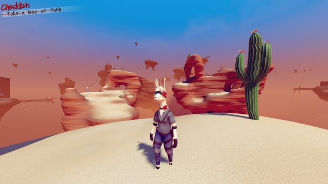

### Allyon: Battlecry

[**Steam**](https://store.steampowered.com/app/3987700/Allyon_Battlecry) |
[**YouTube**](https://www.youtube.com/watch?v=ThOCM9TK_yo) |
[Discord](https://discord.com/channels/723850269347283004/1414791861977092297/1414791861977092297) |
_by Clementine Games_

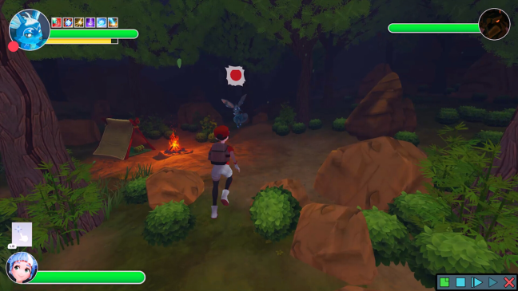

### Voxel game

[**YouTube**](https://www.youtube.com/@ayrton-dev) |
[**BlueSky**](https://bsky.app/profile/aj213.bsky.social) |
[Discord](https://discord.com/channels/723850269347283004/1349621408036294678/1349621408036294678) |
_by Ayrton_

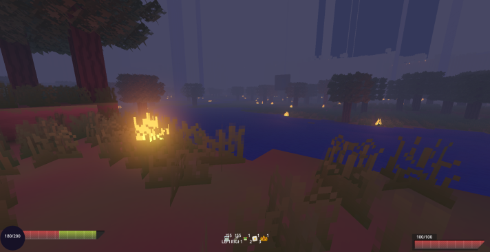

## Commercially released games

Finished games, available on platforms like Steam, Google Play, Apple Store, etc.

### Solitaire Klondike Classic

[**Google Play**](https://play.google.com/store/apps/details?id=com.iscoolentertainment.klondike.solitaire) |
[**Apple Store**](https://apps.apple.com/us/app/klondike-classic/id6752410190) |
[Discord](https://discord.com/channels/723850269347283004/1436363386605797437) |
_by IsCool Entertainment_

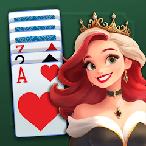

### Graphwar II

[**Steam**](https://store.steampowered.com/app/3066840/Graphwar_II/) |
[**Google Play**](https://play.google.com/store/apps/details?id=com.graphwar.graphwar_ii) |
[**Apple Store**](https://apps.apple.com/app/graphwar-ii/id6517357575) |
[Website](https://graphwar.com/) |
[Discord](https://discord.com/channels/723850269347283004/1266403103218077787/1266403103218077787) |
_by Catacorp_

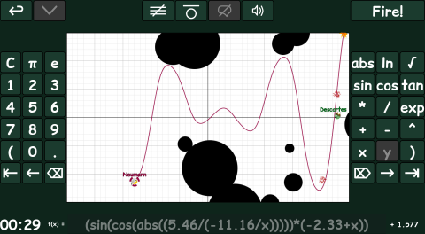

## Educational

Games and simulations from which you can learn, either through the game mechanics or by them being open-source.

### Musical constellations

[**GitHub**](https://github.com/Bauxitedev/musical_constellations) (+ Downloads) |
[**YouTube**](https://www.youtube.com/watch?v=hbHPq21pvbQ) |
[Discord](https://discord.com/channels/723850269347283004/1404037820221362218) |
_by Bauxite_

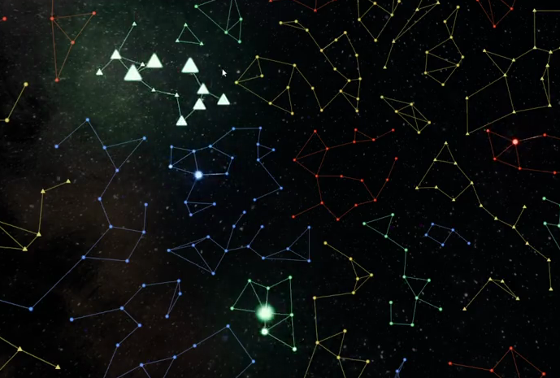

### Gleba

[**Itch.io**](https://calandiel.itch.io/gleba) |
[Devlog](https://calandiel.itch.io/gleba/devlog/1122695/devlog-1-the-start-of-a-new-adventure-v001) |
[Discord](https://discord.com/channels/723850269347283004/1442556427880239145/1442556427880239145) |
_by Calandiel_

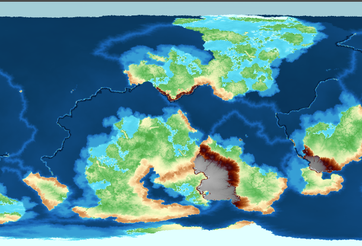

### Sonic Maker

[**GitHub**](https://github.com/lmsonic/sonicmaker) |
[Discord](https://discord.com/channels/723850269347283004/1279886450267263138/1279886450267263138) |
_by iride lombardi_

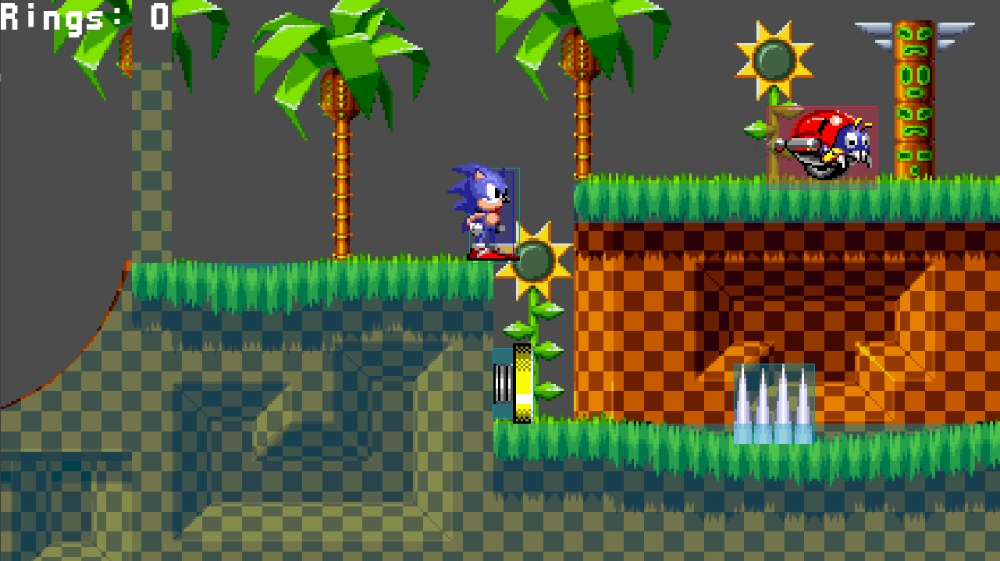

## Web-playable

For people with only a few minutes to spare. Run godot-rust directly inside the browser.  \
These games are developed using [Godot's HTML5 Export](../toolchain/export-web.md).

### Stickyban

[**Itch.io**](https://flowvix.itch.io/stickyban) |
[Discord](https://discord.com/channels/723850269347283004/1383827205955649718/1383827205955649718) |
_by FlowVix_

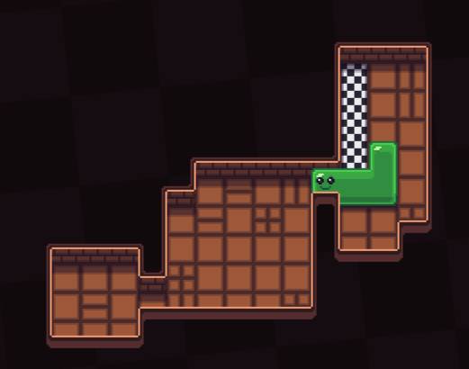

### Block comprehension

[**Itch.io**](https://art4aged.itch.io/block-comprehension) |
[Discord](https://discord.com/channels/723850269347283004/1413218901327614112/1413218901327614112) |
_by Art4Aged_

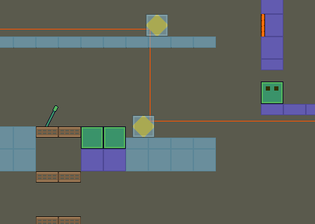

### Aces' Nim

[**Itch.io**](https://puleo.itch.io/aces-nim) |
[Discord](https://discord.com/channels/723850269347283004/1442837592012881971/1442837592012881971) |
_by Puleo_

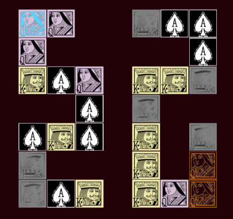
