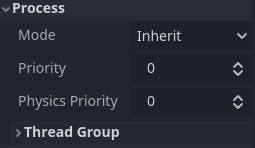
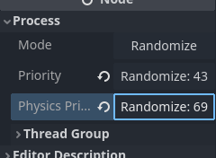

<!--
  ~ Copyright (c) godot-rust; Bromeon and contributors.
  ~ This Source Code Form is subject to the terms of the Mozilla Public
  ~ License, v. 2.0. If a copy of the MPL was not distributed with this
  ~ file, You can obtain one at https://mozilla.org/MPL/2.0/.
-->

# Inspector plugins

The inspector dock allows you to create custom widgets to edit properties through plugins. This can be beneficial when working with custom datatypes and resources, although you can use the feature to change the inspector widgets for built-in types. You can design custom controls for specific properties, entire objects, and even separate controls associated with particular datatypes.

This is implementation of [Godot docs](https://docs.godotengine.org/en/stable/tutorials/plugins/editor/inspector_plugins.html) on rust.

Before:



After:



Add requires to rust (in rust folder, where is Cargo.toml):
```sh
cargo add rand
```

Add file `addon.rs` and import it in `lib.rs`:
```rs
// file: lib.rs
mod addon;
```

Add the following imports at the beginning of the file
```rs
use godot::{
    classes,
    engine::{
        Button, EditorInspectorPlugin, EditorPlugin, EditorProperty, IEditorInspectorPlugin,
        IEditorPlugin, IEditorProperty,
    },
    global,
    prelude::*,
};
use rand::Rng;
```

Since Rust is a statically typed language, we will proceed in reverse order unlike in Godot documentation, to avoid encountering errors unnecessarily.

## Add Property Editor

To begin with, let's define the editor for properties:
```rs
#[derive(GodotClass)]
#[class(tool, init, base=EditorProperty)]
struct RandomNumberEditor {
    base: Base<EditorProperty>,
    button: Option<Gd<Button>>,
}
```

After that, we need to add an implementation for the trait `IEditorProperty`:
```rs
#[godot_api]
impl IEditorProperty for RandomNumberEditor {
    fn enter_tree(&mut self) {
        // Create button element
        let mut button = Button::new_alloc();
        // Add handler for this button, handle_press will be define in another impl
        button.connect(
            "pressed".into(),
            self.base().callable("handle_press".to_godot()),
        );
        button.set_text("Randomize".into());
        // Save pointer to the button into struct
        self.button = Some(button.clone());
        self.base_mut().add_child(button.to_variant().to());
    }

    fn exit_tree(&mut self) {
        // Remove element from inspector when this plugin unmount:
        if let Some(button) = self.button.take() {
            self.base_mut().remove_child(button.to_variant().to());
        } else {
            // Log error if button disappeared before
            godot_error!("Button wasn't found in exit_tree");
        }
    }
}
```

Let's add a handler for the button:
```rs
#[godot_api]
impl RandomNumberEditor {
    #[func]
    fn handle_press(&mut self) {
        // Update value by button click
        // - take prop name, randomize number
        // - send prop name and random number to godot engine for update value
        // - update button text
        let property_name = self.base().get_edited_property();
        let num = rand::thread_rng().gen_range(0..100);
        godot_print!("Randomize! {} for {}", num, property_name);
        self.base_mut()
            .emit_changed(property_name, num.to_variant().to());
        if let Some(mut button) = self.button.clone() {
            let text = format!("Randomize: {}", num);
            button.set_text(text.into());
        } else {
            // Print error of something went wrong
            godot_error!("Button wasn't found in handle_press");
        }
    }
}
```

## Add Inspector plugin

Now we need to connect this editor to fields with an integer type.
To do this, we need to create an EditorInspectorPlugin.
```rs
#[derive(GodotClass)]
#[class(tool, init, base=EditorInspectorPlugin)]
struct RandomInspectorPlugin {
    base: Base<EditorInspectorPlugin>,
}
```

IEditorInspectorPlugin implementation:
```rs
#[godot_api]
impl IEditorInspectorPlugin for RandomInspectorPlugin {
    fn parse_property(
        &mut self,
        _: Gd<classes::Object>, // inspect object
        type_: VariantType, // value type
        name: GString, // property name
        _: global::PropertyHint, // hint type
        _: GString, // hit name
        _: global::PropertyUsageFlags, // property usage flag
        _: bool, // wide
    ) -> bool {
        if type_ == VariantType::INT {
            let editor = RandomNumberEditor::new_alloc().to_variant().to();
            self.base_mut().add_property_editor(name, editor);
            return true;
        }

        false
    }

    fn can_handle(&self, _: Gd<classes::Object>) -> bool {
        true
    }
}
```

If `parse_property` returns `true`, the editor will be created and replace the current representation; if not, it's necessary to return `false`. This allows for specific control over where and how processing occurs.

## Add Editor Plugin

Only one thing left to do: define the editor plugin that will kick off all this magic! This can be a generic EditorPlugin or a more specific InspectorEditorPlugin, depending on what you want to achieve.


```rs
#[derive(GodotClass)]
#[class(tool, init, editor_plugin, base=EditorPlugin)]
struct RustEditorPlugin {
    base: Base<EditorPlugin>,
    random_inspector: Gd<RandomInspectorPlugin>,
}
```

```rs
#[godot_api]
impl IEditorPlugin for RustEditorPlugin {
    fn enter_tree(&mut self) {
        // create our inspector plugin and save it to next remove
        self.random_inspector = RandomInspectorPlugin::new_gd();
        self.to_gd()
            .add_inspector_plugin(self.random_inspector.to_variant().to());
    }

    fn exit_tree(&mut self) {
        self.to_gd()
            .remove_inspector_plugin(self.random_inspector.to_variant().to());
    }
}
```

```admonish danger title="Troubleshooting"
Sometimes after compilation, you may encounter errors or panic. Most likely, all you need to do is simply **restart** the Godot Editor.
```
Example error:

```log
Initialize godot-rust (API v4.2.stable.official, runtime v4.2.2.stable.official)
ERROR: Cannot get class 'RandomInspectorPlugin'.
   at: (core/object/class_db.cpp:392)
ERROR: Cannot get class 'RandomInspectorPlugin'.
   at: (core/object/class_db.cpp:392)
```

# Full code

<details>
  <summary>addon.rs</summary>

  ```rs
      use godot::{
          classes,
          engine::{
              Button, EditorInspectorPlugin, EditorPlugin, EditorProperty, IEditorInspectorPlugin,
              IEditorPlugin, IEditorProperty,
          },
          global,
          prelude::*,
      };
      use rand::Rng;

      #[derive(GodotClass)]
      #[class(tool, init, editor_plugin, base=EditorPlugin)]
      struct RustEditorPlugin {
          base: Base<EditorPlugin>,
          random_inspector: Gd<RandomInspectorPlugin>,
      }

      #[godot_api]
      impl IEditorPlugin for RustEditorPlugin {
          fn enter_tree(&mut self) {
              self.random_inspector = RandomInspectorPlugin::new_gd();
              self.to_gd()
                  .add_inspector_plugin(self.random_inspector.to_variant().to());
          }

          fn exit_tree(&mut self) {
              self.to_gd()
                  .remove_inspector_plugin(self.random_inspector.to_variant().to());
          }
      }

      #[derive(GodotClass)]
      #[class(tool, init, base=EditorInspectorPlugin)]
      struct RandomInspectorPlugin {
          base: Base<EditorInspectorPlugin>,
      }

      #[godot_api]
      impl IEditorInspectorPlugin for RandomInspectorPlugin {
          fn parse_property(
              &mut self,
              _: Gd<classes::Object>,
              type_: VariantType,
              name: GString,
              _: global::PropertyHint,
              _: GString,
              _: global::PropertyUsageFlags,
              _: bool,
          ) -> bool {
              if type_ == VariantType::INT {
                  self.base_mut()
                      .add_property_editor(name, RandomNumberEditor::new_alloc().to_variant().to());
                  return true;
              }

              false
          }

          fn can_handle(&self, _: Gd<classes::Object>) -> bool {
              true
          }
      }

      #[derive(GodotClass)]
      #[class(tool, init, base=EditorProperty)]
      struct RandomNumberEditor {
          base: Base<EditorProperty>,
          button: Option<Gd<Button>>,
      }

      #[godot_api]
      impl RandomNumberEditor {
          #[func]
          fn handle_press(&mut self) {
              let property_name = self.base().get_edited_property();
              let num = rand::thread_rng().gen_range(0..100);
              godot_print!("Randomize! {} for {}", num, property_name);
              self.base_mut()
                  .emit_changed(property_name, num.to_variant().to());
              if let Some(mut button) = self.button.clone() {
                  let text = format!("Randomize: {}", num);
                  button.set_text(text.into());
              } else {
                  godot_error!("Button wasn't found in handle_press");
              }
          }
      }

      #[godot_api]
      impl IEditorProperty for RandomNumberEditor {
          fn enter_tree(&mut self) {
              let mut button = Button::new_alloc();
              button.connect(
                  "pressed".into(),
                  self.base().callable("handle_press".to_godot()),
              );
              button.set_text("Randomize".into());
              self.base_mut().add_child(button.to_variant().to());
              self.button = Some(button);
          }

          fn exit_tree(&mut self) {
              if let Some(button) = self.button.take() {
                  self.base_mut().remove_child(button.to_variant().to());
              } else {
                  godot_error!("Button wasn't found in exit_tree");
              }
          }
      }
  ```
</details>