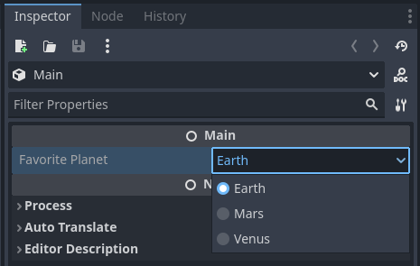

<!--
  ~ Copyright (c) godot-rust; Bromeon and contributors.
  ~ This Source Code Form is subject to the terms of the Mozilla Public
  ~ License, v. 2.0. If a copy of the MPL was not distributed with this
  ~ file, You can obtain one at https://mozilla.org/MPL/2.0/.
-->

# Registering properties

So far, you learned how to register classes and functions. This is already powerful enough to create simple applications with godot-rust,
however you might want to give Godot more direct access to the state of your object.

This is where properties come into play. In Rust, properties are typically defined as fields of a struct.

See also [GDScript reference for properties][godot-gdscript-properties].


## Table of contents

<!-- toc -->


## Registering variables

Previously, we defined a function `Monster::get_name()`. This works to fetch the name, but requires you to write `obj.get_name()` in GDScript.
Sometimes, you do not need this extra encapsulation and would like to access the field directly.

The gdext library provides an attribute `#[var]` to annotate fields that should be exposed as variables. This works like the `var` keyword in
GDScript.

Starting with the earlier struct declaration, we now add the `#[var]` attribute to the `name` field. We also change the type from `String` to
`GString`, since this field is now directly interfacing Godot.

```rs
#[derive(GodotClass)]
#[class(init, base=Node3D)]
struct Monster {
    #[var]
    name: GString,
    hitpoints: i32,
}
```

The effect of this is that `name` is now registered as a _property_ in Godot:

```php
var monster = Monster.new()

# Write the property.
monster.name = "Orc"

# Read the property.
print(monster.name) # prints "Orc"
```

In GDScript, properties are syntactic sugar for function calls to getters and setters. You can also do so explicitly:

```php
var monster = Monster.new()

# Write the property.
monster.set_name("Orc")

# Read the property.
print(monster.get_name()) # prints "Orc"
```

The `#[var]` attribute also takes parameters to customize whether both getters and setters are provided, and what their names are. You can
also write Rust methods acting as getters and setters, if you have more involved logic. See the [API documentation][api-var-export] for details.


```admonish info title="Visibility"
Like `#[func]` functions, `#[var]` fields do not need to be `pub`. This separates visibility towards Godot and towards Rust.

In practice, you can still access `#[var]` fields from Rust, but via detours (e.g. Godot's reflection APIs). But this is then a deliberate
choice; private fields are primarily preventing _accidental_ mistakes or encapsulation breaches.
```


## Exporting variables

The `#[var]` attribute exposes a field to GDScript, but does not display it in the Godot editor UI.

Making a property available to the editor is called _exporting_. Like the GDScript annotation `@export`, gdext provides exports through the
`#[export]` attribute. You might see a pattern with naming here.

The following code not only makes the `name` field available to GDScript, but it also adds a property UI in the editor. This allows you to
name every `Monster` instance individually, without any code!

```rs
#[derive(GodotClass)]
#[class(init, base=Node3D)]
struct Monster {
    #[export]
    name: GString,
    hitpoints: i32,
}
```

You may have noticed that there is no longer a `#[var]` attribute. This is because `#[export]` always implies `#[var]` -- the name is still
accessible from GDScript like before.

You can also declare both attributes on the same field. This is in fact necessary as soon as you provide arguments to customize them.


## Enums

You can export Rust enums as properties. An exported enum appears as a drop-down field in the editor, with all available options.
In order to do that, you need to derive three traits:

- `GodotConvert` to define how the type is converted from/to Godot.
- `Var` to allow using it as a `#[var]` property, so it can be accessed from Godot.
- `Export` to allow using it as a `#[export]` property, so it appears in the editor UI.

Godot does not have dedicated enum types, so you can map them either as integers (e.g. `i64`) or strings (`GString`). This can be
configured using the `via` key of the `#[godot]` attribute.

Exporting an enum can be done as follows:

```rust
#[derive(GodotConvert, Var, Export)]
#[godot(via = GString)]
pub enum Planet {
    Earth, // first enumerator is default.
    Mars,
    Venus,
}

#[derive(GodotClass)]
#[class(base=Node)]
pub struct SpaceFarer {
    #[export]
    favorite_planet: Planet,
}
```

The above will show up as follows in the editor UI:



Refactoring the Rust enum may impact already serialized scenes, so be mindful if you want to choose integers or strings as the underlying
representation:

- Integers enable renaming variants without breaking existing scenes, however new ones must be strictly added at the end, and existing
  ones cannot be removed or reordered.
- Strings allow free reordering and removing (if unused) and make debugging easier. However, you cannot rename them, and they take slightly
  more space (only relevant if you have tens of thousands).

Of course, it is always possible to adjust existing scene files, but this involves manual search&replace and is generally error-prone.

```admonish warning title="Enums in GDScript"
Enums are not first-class citizens in Godot. Even if you define them in GDScript, they are mostly syntactic sugar for constants.
This declaration:
~~~php
enum Planet {
    EARTH,
    VENUS,
    MARS,
}

@export var favorite_planet: Planet
~~~
is roughly the same as:
~~~php
const EARTH = 0
const VENUS = 1
const MARS = 2

@export_enum("EARTH", "VENUS", "MARS") var favorite_planet = Planet.EARTH
~~~
However, the enum is not type-safe, you can just do this:
~~~php
var p: Planet = 5
~~~
Furthermore, unless you initialize the constants with string values, you cannot retrieve their names, making debugging harder. There is no
reflection either, such as "get number of enum values" or "iterate over all of them". If you have the choice, consider keeping enums in Rust.
```


## Advanced usage

Both `#[var]` and `#[export]` attributes accept parameters to further customize how properties are registered in Godot.
Consult the [API documentation][api-var-export] for details.

```admonish info title="PackedArray mutability"
`Packed*Array` types use copy-on-write semantics, meaning every new instance can be considered an independent copy. When a Rust-side packed
array is registered as a property, GDScript will create a new instance of the array when you mutate it, making changes invisible to Rust code.
There is a [GitHub issue][gh-godot-packedarray] with more details.

Instead, use `Array<T>` or register designated `#[func]` methods that perform the mutation on Rust side.
```


## Custom types with `#[var]` and `#[export]`

If you want to register properties of user-defined types, so they become accessible from GDScript code (`#[var]`) or additionally from the
editor (`#[export]`), then you can implement the `Var` and `Export` traits, respectively.

These traits also come with derive macros, [`#[derive(Var)]`][api-derive-var] and [`#[derive(Export)]`][api-derive-export].

```admonish warning title="Performance"
Enabling all sorts of types for `Var` and `Export` seems convenient, but keep in mind that your conversion functions are invoked every time
the engine accesses the property, which may sometimes be behind the scenes. Especially for `#[export]` fields, interactions with the editor UI
or serialization to/from scene files can cause a quite a bit of traffic.

As a general rule, try to stay close to Godot's own types, e.g. `Array`, `Dictionary` or `Gd`. These are reference-counted or simple pointers.
```


[api-derive-export]: https://godot-rust.github.io/docs/gdext/master/godot/register/derive.Export.html
[api-derive-var]: https://godot-rust.github.io/docs/gdext/master/godot/register/derive.Var.html
[api-var-export]: https://godot-rust.github.io/docs/gdext/master/godot/register/derive.GodotClass.html#properties-and-exports
[godot-gdscript-properties]: https://docs.godotengine.org/en/stable/tutorials/scripting/gdscript/gdscript_basics.html#properties
[gh-godot-packedarray]: https://github.com/godotengine/godot/issues/76150
