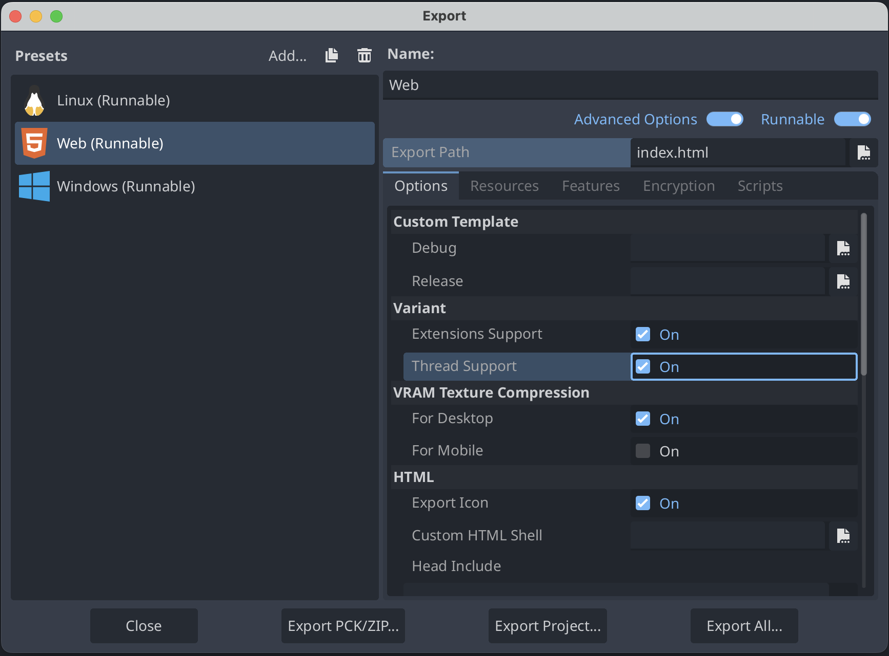
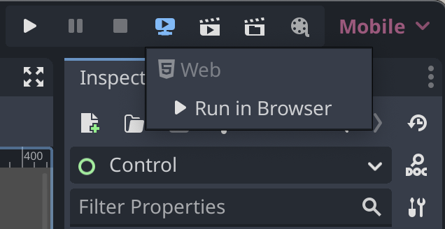

<!--
  ~ Copyright (c) godot-rust; Bromeon and contributors.
  ~ This Source Code Form is subject to the terms of the Mozilla Public
  ~ License, v. 2.0. If a copy of the MPL was not distributed with this
  ~ file, You can obtain one at https://mozilla.org/MPL/2.0/.
-->

# Export to macOS and iOS

Mac and iOS builds that are intended for the App Store or to be shared with other people require Code Signing and Notarization. For this you will need:

- A Mac Computer
- An Apple ID enrolled in Apple Developer Program (99 USD per year)

Without Code Signing and Notarization the other person can still use the built library or program, but either need to rebuild the whole thing locally or re-sign or accept that it may contain mallicious code.

Prerequisites:

- Download and Install [Xcode](https://developer.apple.com/xcode/) on Your Mac Computer

## Building macOS universal lib

Add as targets both x64 and arm64 targets. This is needed in order to create a universal build.


```sh
rustup target add x86_64-apple-darwin
rustup target add aarch64-apple-darwin
```

Build the library for both target architectures:

```sh
cargo build --target=x86_64-apple-darwin --release
cargo build --target=aarch64-apple-darwin --release
```

Run the [lipo](https://developer.apple.com/documentation/apple-silicon/building-a-universal-macos-binary) tool to merge the two in one universal library.

```sh
lipo -create -output target/release/libmy_lib.macos.dylib target/aarch64-apple-darwin/release/libmy_lib.dylib target/x86_64-apple-darwin/release/libmy_lib.dylib
```

The result of this will be the file `target/release/libmy_lib.macos.dylib` that will now have support for both x64 and arm64 platforms.

Note: The name of your library will be the one you provided in `Cargo.toml` file, prefixed with `lib` and followed by `.dylib`:
```
[package]
name = "my_lib"
```

Next, you will need to create the `.framework` folder.

```sh
mkdir target/release/libmy_lib.macos.framework
cp target/release/libmy_lib.macos.dylib target/release/libmy_lib.macos.framework/libmy_lib.macos.dylib
```

Next, create the `Info.plist` file inside the `Resources` folder

```sh
mkdir target/release/libmy_lib.macos.framework/Resources
```
File contents:
```xml
<?xml version="1.0" encoding="UTF-8"?>
<!DOCTYPE plist PUBLIC "-//Apple//DTD PLIST 1.0//EN" "http://www.apple.com/DTDs/PropertyList-1.0.dtd">
<plist version="1.0">
<dict>
	<key>CFBundleExecutable</key>
	<string>libmy_lib.macos.dylib</string>
	<key>CFBundleIdentifier</key>
	<string>org.mywebsite.myapp</string>
	<key>CFBundleInfoDictionaryVersion</key>
	<string>6.0</string>
	<key>CFBundleName</key>
	<string>My App Name</string>
	<key>CFBundlePackageType</key>
	<string>FMWK</string>
	<key>CFBundleShortVersionString</key>
	<string>1.0.0</string>
	<key>CFBundleSupportedPlatforms</key>
	<array>
		<string>MacOSX</string>
	</array>
    <key>NSHumanReadableCopyright</key>
	<string>Copyright (c)...</string>
	<key>CFBundleVersion</key>
	<string>1.0.0</string>
	<key>LSMinimumSystemVersion</key>
	<string>10.12</string>
</dict>
</plist>
```

Note: The `CFBundleExecutable` name MUST match the dylib file name. Some of the contents in the XML file MUST not contain some characters. Generally avoid using anything other than letters and numbers. Related [stack overflow issue](https://stackoverflow.com/questions/3757817/plist-contains-the-character).


Edit the project's `.gdextension` file to include support for iOS.
This file will probably be at `godot/{YourCrate}.gdextension`.
The format will be similar to the following:

```ini
[libraries]
...
macos.release = "res://../rust/target/release/libmy_lib.macos.framework"
```

## Building iOS lib

Add as target arm64 iOS.


```sh
rustup target add aarch64-apple-ios
```

Build the library for both target architectures:

```sh
cargo build --target=aarch64-apple-ios --release
```

The result of this will be the file `target/aarch64-apple-ios/release/libmy_lib.dylib`.

Next, you will need to create the `.framework` folder.

```sh
mkdir target/release/libmy_lib.ios.framework
cp target/release/libmy_lib.ios.dylib target/release/libmy_lib.ios.framework/libmy_lib.ios.dylib
```

Next, create the `Info.plist` file inside the `.framework` folder

File contents:
```xml
<?xml version="1.0" encoding="UTF-8"?>
<!DOCTYPE plist PUBLIC "-//Apple Computer//DTD PLIST 1.0//EN" "http://www.apple.com/DTDs/PropertyList-1.0.dtd">
<plist version="1.0">
<dict>
	<key>CFBundleInfoDictionaryVersion</key>
	<string>6.0</string>
	<key>CFBundleDevelopmentRegion</key>
	<string>en</string>
	<key>CFBundleExecutable</key>
	<string>libmy_lib.ios.dylib</string>
	<key>CFBundleName</key>
	<string>My App Name</string>
	<key>CFBundleDisplayName</key>
	<string>My App Name</string>
	<key>CFBundleIdentifier</key>
	<string>org.my-website.my-app</string>
	<key>NSHumanReadableCopyright</key>
	<string>Copyright (c) ...</string>
	<key>CFBundleVersion</key>
	<string>0.12.0</string>
	<key>CFBundleShortVersionString</key>
	<string>0.12.0</string>
	<key>CFBundlePackageType</key>
	<string>FMWK</string>
	<key>CSResourcesFileMapped</key>
	<true/>
	<key>DTPlatformName</key>
	<string>iphoneos</string>
	<key>MinimumOSVersion</key>
	<string>12.0</string>
</dict>
</plist>

```

Note: The `CFBundleExecutable` name MUST match the dylib file name. Some of the contents in the XML file MUST not contain some characters. Generally avoid using anything other than letters and numbers. Related [stack overflow issue](https://stackoverflow.com/questions/3757817/plist-contains-the-character).


Edit the project's `.gdextension` file to include support for iOS.
This file will probably be at `godot/{YourCrate}.gdextension`.
The format will be similar to the following:

```ini
[libraries]
...
ios.release = "res://../rust/target/release/libmy_lib.ios.framework"
```

## Code Signing and Notarizing (macOS only)

In order to Code Sign and Notarize your app, you will first need to gather some stuff from your Apple Developer Enrolled Account. We will put them each in an environment variable and use a script to sign, so it's easier to run. Here are the environment variables needed:

- APPLE_CERT_BASE64
- APPLE_CERT_PASSWORD
- APPLE_DEV_ID
- APPLE_DEV_TEAM_ID
- APPLE_DEV_PASSWORD
- APPLE_DEV_APP_ID

Firstly, make sure to enroll your Apple ID to Developer Program:

- Create an Apple ID if you don’t have one already.
- Use your Apple ID to register in the Apple Developer Program by going to [developer.apple.com](https://developer.apple.com)
- Accept all agreements from the Apple Developer Page.

### APPLE_DEV_ID - Apple ID

Your email used for your Apple ID.
```
APPLE_DEV_ID = email@provider.com
```
### APPLE_DEV_TEAM_ID - Apple Team ID

Go to [developer.apple.com](https://developer.apple.com). Go to account.

Go to membership details. Copy Team ID.
```
APPLE_DEV_TEAM_ID = 1ABCD23EFG
```
### APPLE_DEV_PASSWORD - Apple App-Specific Password

Create Apple App-Specific Password. Copy the password.
```
APPLE_DEV_PASSWORD = abcd-abcd-abcd-abcd
```

### APPLE_CERT_BASE64 and APPLE_CERT_PASSWORD and APPLE_DEV_APP_ID

Go to [developer.apple.com](https://developer.apple.com). Go to account.

Go to certificates.

Click on + at Certificates tab. Create Developer ID Application. Click Continue.

Leave profile type as is. Create a certificate signing request from a mac. You can use your own name and email address. Save the file to disk. You will get a file called CertificateSigningRequest.certSigningRequest. Upload it to the Developer ID Application request. Click Continue.

Download the certificate. You will get a file developerID_application.cer.

On a Mac, right click and select open. Add it to the login keychain. In the Keychain Access app that opened, login Keychain tab, go to Keys, sort by date modified, expand your key (the key should have name you entered at common name Common Name), right click the expanded certificate, get info, and copy the text at Details -> Subject Name -> Common Name. Eg.
```
APPLE_DEV_APP_ID = Developer ID Application: Common Name (1ABCD23EFG)
```
Then, select the certificate, right click and click export. At file format select p12. When exporting, set a password for the certificate. This will be APPLE_CERT_PASSWORD. You will get a Certificates.p12 file.

Eg.
```
APPLE_CERT_PASSWORD = <password_set_when_exporting_p12>
```
Then you need to make a base64 file out of it, by running:
```
base64 -i Certificates.p12 -o Certificates.base64
```
Copy the contents of the generated file: Eg.
APPLE_CERT_BASE64 = ...(A long text file)

After these secrets are obtained, all that remains is to set them as environment variables. Afterwards you can use the following script for signing [ci-sign-macos.ps1](https://github.com/appsinacup/godot-rapier-physics/blob/main/scripts/ci-sign-macos.ps1). In order to run this script you will need to install [powershell](https://learn.microsoft.com/en-us/powershell/) on your Mac.
```powershell
ci-sign-macos.ps1 target/release/my_lib.framework
```


[api-cargo-features]: https://godot-rust.github.io/docs/gdext/master/godot/#cargo-features


## Compile the Project

Verify `emcc` is in the `PATH`. This can be as simple as doing the following:

```sh
emcc --version
```

Compile the code.
It is necessary to both use the nightly compiler and specify to build std[^3], along with specifying the Emscripten target.

```sh
cargo +nightly build -Zbuild-std --target wasm32-unknown-emscripten
```


## Godot editor setup

Add a web export in the Godot Editor. In the top menu bar, go to `Project > Export...` and configure it there.
Make sure to turn on the `Extensions Support` checkbox.



If instead, the bottom on the export popup contains this error in red:

> No export template found at expected path:

Then click on `Manage Export Templates` next to the error message, and then on the next screen select `Download and Install`.
See [Godot tutorial][godot-export-templates] for further information.


### Running the webserver

Back at the main editor screen, there is an option to run the web debug build (_not_ a release build) locally
without needing to run an export or set up a web server.
At the top right, choose `Remote Debug > Run in Browser` and it will automatically open up a web browser.




```admonish warning title="Known Caveats"
- Godot 4.1.3+ or 4.2+ is necessary.
- Only Chromium-based browsers (Chrome or Edge) appear to be supported by GDExtension at the moment; Firefox and Safari don't work yet.
  Info about browser support can be found [here](https://github.com/godotengine/godot-cpp/pull/1247#issuecomment-1742197814).
```

If your default browser is not Chromium-based, you will need to copy the URL (which is usually `http://localhost:8060/tmp_js_export.html`)
and open it in a supported browser such as Google Chrome or Microsoft Edge.

[godot-export-templates]: https://docs.godotengine.org/en/stable/tutorials/export/exporting_projects.html#export-menu


## Debugging

Currently, the only option for WASM debugging is
[this extension](https://chromewebstore.google.com/detail/cc++-devtools-support-dwa/pdcpmagijalfljmkmjngeonclgbbannb?pli=1)
for Chrome. It adds support for breakpoints and a memory viewer into the F12 menu.


<br>

---

[^1]: Note: Due to a bug with `emscripten`, the maximum version of `emcc`[^2] that can one compile `Godot` with is `3.1.39`.  gdext itself should be able to support the latest version of `emcc`, however, it may be a safer bet to stick to version `3.1.39`.

[^2]: `emcc` is the name of Emscripten's compiler.

[^3]: The primary reason for this is it is necessary to compile with `-sSHARED_MEMORY` enabled. The shipped `std` does not, so building `std` is a requirement. Related info on about WASM support can be found [here](https://github.com/rust-lang/rust/issues/77839).

