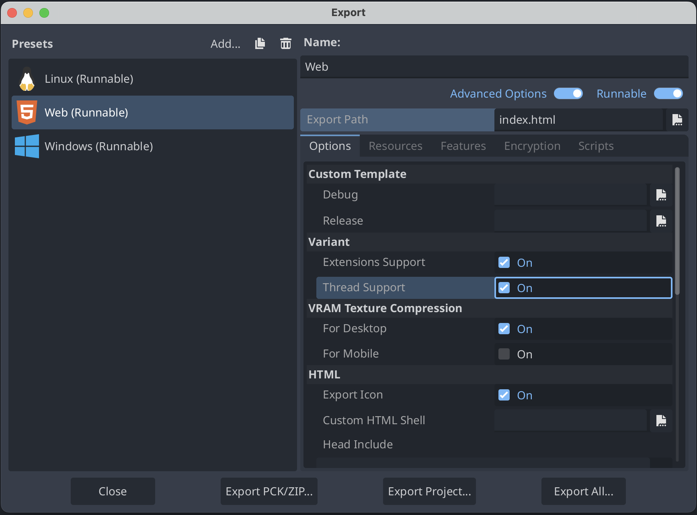
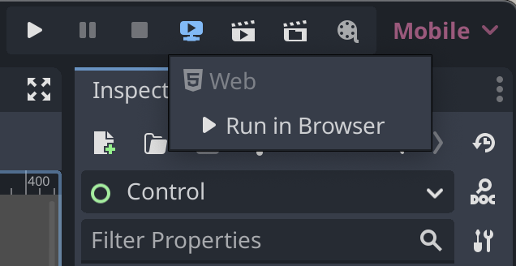

<!--
  ~ Copyright (c) godot-rust; Bromeon and contributors.
  ~ This Source Code Form is subject to the terms of the Mozilla Public
  ~ License, v. 2.0. If a copy of the MPL was not distributed with this
  ~ file, You can obtain one at https://mozilla.org/MPL/2.0/.
-->

# Export to Web

Web builds are a fair bit more difficult to get started with compared to native builds.
This will be a complete guide on how to get things compiled.
However, setting up a web server to host and share your game is considered out of scope of this guide, and is best explained elsewhere.

```admonish warning
Web support with gdext is experimental and should be understood as such before proceeding.
```


## Installation

Install a nightly build of `rustc`, the `wasm32-unknown-emscripten` target for `rustc`, and `rust-src`.
The reason why nightly `rustc` is required is the unstable flag to build `std` ([`-Zbuild-std`][flag-build-std]).
Assuming that Rust was installed with `rustup`, this is quite simple.


  ```sh
  rustup toolchain install nightly
  rustup component add rust-src --toolchain nightly
  rustup target add wasm32-unknown-emscripten --toolchain nightly
  ```

Next, install Emscripten.  The simplest way to achieve this is to install [`emsdk` from the git repo][emsdk-git].
We recommend version 3.1.62 or later when targeting Godot 4.3 or later.[^1]

```sh
git clone https://github.com/emscripten-core/emsdk.git
cd emsdk
./emsdk install 3.1.62
./emsdk activate 3.1.62
source ./emsdk.sh     (or ./emsdk.bat on windows)
```

It would also be **highly** recommended to follow the instructions in the terminal to add `emcc`[^2] to your `PATH`.
If not, it is necessary to manually `source` the `emsdk.sh` file in every new terminal prior to compilation.
This is platform-specific.

[flag-build-std]: https://doc.rust-lang.org/cargo/reference/unstable.html#list-of-unstable-features
[emsdk-git]: https://github.com/emscripten-core/emsdk#readme


## Project Configuration

Enable the [`experimental-wasm`][api-cargo-features] feature on gdext in the `Cargo.toml` file.
It is also recommended to enable the [`lazy-function-tables`][api-cargo-features] feature to avoid long compile times with release builds
(this might be a bug and not necessary in the future). Edit the line to something like the following:

```toml
[dependencies.godot]
git = "https://github.com/godot-rust/gdext"
branch = "master"
features = ["experimental-wasm", "lazy-function-tables"]
```

Next, begin configuring the `emcc` flags and export targets as below. These initial settings will assume that your extension needs multi-threading
support, but that's usually not the case, so make sure to check the ["Thread support" section](#thread-support-godot-43-or-later) below if you're
exporting to Godot 4.3 or later.

If you do not already have a `.cargo/config.toml` file, do the following:

- Create a `.cargo` directory at the same level as your `Cargo.toml`.
- Inside that directory, create a `config.toml` file.

Start by adding the following contents to that file:

<!-- NOTE: When changing the code block below, make sure to change its copy under 'Thread support' as well. -->
```toml
[target.wasm32-unknown-emscripten]
rustflags = [
    "-C", "link-args=-pthread", # /!\ Read 'Thread support' below regarding this flag
    "-C", "link-args=-sSIDE_MODULE=2",
    "-C", "target-feature=+atomics,+bulk-memory,+mutable-globals",
    "-Zlink-native-libraries=no",
    "-Cllvm-args=-enable-emscripten-cxx-exceptions=0",
]
```

Edit the project's `.gdextension` file to include support for web exports.
This file will probably be at `godot/{YourCrate}.gdextension`.
The format will be similar to the following:

```ini
[libraries]
...
web.debug.wasm32 = "res://../rust/target/wasm32-unknown-emscripten/debug/{YourCrate}.wasm"
web.release.wasm32 = "res://../rust/target/wasm32-unknown-emscripten/release/{YourCrate}.wasm"
```


## Compile the Project

Verify `emcc` is in the `PATH`. This can be as simple as doing the following:

```sh
emcc --version
```

Now, try to compile your code.
It is necessary to both use the nightly compiler and specify to build std[^3], along with specifying the Emscripten target.

```sh
cargo +nightly build -Zbuild-std --target wasm32-unknown-emscripten
```

Note that you may have to use a different build command in order to let the extension work in single-threaded web export in Godot 4.3+ (see the
["Thread support" section](#thread-support-godot-43-or-later) below for more information).


## Thread support (Godot 4.3 or later)

```admonish note
The following section assumes your extension targets Godot 4.3 or later. If your extension will only target Godot 4.2 or 4.1, you may
keep the initial configuration from [Project Configuration](#project-configuration) without any changes.
```

The above settings assume that multi-threading support is always needed for your extension. However, starting with Godot 4.3, when the end user
exports a game to the web, Godot includes an option to disable _Thread Support_ in the web export menu
(see the image in the ["Godot editor setup" section](#godot-editor-setup)), with the goal of having the exported game run in more environments,
including older browsers, as well as webservers without Cross-Origin Isolation support.

With the proposed initial configuration from ["Project configuration"](#project-configuration), if the end user disabled _Thread Support_,
your extension would break. If you'd like your extension to support builds without multi-threading as well to avoid this problem,
you will need to update your build setup in one of the two following ways.


### Building without multi-threading support

In this scenario, you'd like to build your extension without any multi-threading support, that is, to have your extension only work
when _Thread Support_ is disabled.

To do that, you must remove the line with the `-pthread` flag from `.cargo/config.toml`,
as well as enable the [`experimental-wasm-nothreads`][api-cargo-features] feature in `Cargo.toml`.

The remaining configuration and build command do not require further changes.

This setup, by itself, isn't very common. We recommend following the instructions below to accept both multi-threaded and single-threaded exports for
your extension.


### Building both with and without multi-threading support

This is the recommended approach and allows your extension to work in both multi-threaded and single-threaded exports.

For that to happen, your extension will need to have two separate builds, one for each mode (with and without multi-threading).

Afterwards, Godot will automatically pick the correct build depending on whether the user chooses to enable or disable _Thread Support_
when exporting to the web.

Here's how this can be done:

1. Remove `"-C", "link-args=-pthread"` from `.cargo/config.toml` so that you may conditionally enable it afterwards,
    resulting in the following updated `.cargo/config.toml` file:

    ```toml
    [target.wasm32-unknown-emscripten]
    rustflags = [
        "-C", "link-args=-sSIDE_MODULE=2",
        "-C", "target-feature=+atomics,+bulk-memory,+mutable-globals",
        "-Zlink-native-libraries=no",
        "-Cllvm-args=-enable-emscripten-cxx-exceptions=0",
    ]
    ```

2. Create a feature for your main crate which enables [`experimental-wasm-nothreads`][api-cargo-features] when used.
    You can do this by creating a `[features]` section in your crate's `Cargo.toml` as follows:

    ```toml
    [features]
    nothreads = ["gdext/experimental-wasm-nothreads"]
    ```

    Note that this feature should be enabled on any crates depending on gdext, so if you have more than one crate in your workspace,
    you should add the same `[features]` section above to each other crate using gdext, and then enable each crate's `nothreads` feature
    from the main crate (which provides the extension's entrypoint).

    For example, if you have a workspace with one main crate called `extension` and two other crates called `lib1` and `lib2`,
    each depending on gdext, then you may add the `[features]` section above to `crates/lib1/Cargo.toml` and `crates/lib2/Cargo.toml`,
    and then add the following to `crates/extension/Cargo.toml`:

    ```toml
    [features]
    # Ensure that enabling `nothreads` for the main crate also enables
    # that feature for other crates.
    nothreads = [
        "lib1/nothreads",
        "lib2/nothreads",
        "gdext/experimental-wasm-nothreads"
    ]
    ```
3. Edit your `.gdextension` file to list two separate Wasm binary paths - one for the threaded build and one for the `nothreads` build, as follows:

    ```ini
    [libraries]
    ...
    web.debug.threads.wasm32 = "res://../rust/target/wasm32-unknown-emscripten/debug/{YourCrate}.threads.wasm"
    web.release.threads.wasm32 = "res://../rust/target/wasm32-unknown-emscripten/release/{YourCrate}.threads.wasm"
    web.debug.wasm32 = "res://../rust/target/wasm32-unknown-emscripten/debug/{YourCrate}.wasm"
    web.release.wasm32 = "res://../rust/target/wasm32-unknown-emscripten/release/{YourCrate}.wasm"
    ```

4. Have two separate build commands, executed in the following order:
    1. **Building with multi-threading support:** you must add the `-pthread` flag back manually through the `RUSTFLAGS` environment variable,
    but NOT enable the `nothreads` feature yet.

        Afterwards, you should rename the generated Wasm binary, such that it can be picked up by the modified `.gdextension` file
        as a threaded build:

       ```sh
       RUSTFLAGS="-C link-args=-pthread" cargo +nightly build -Zbuild-std --target wasm32-unknown-emscripten
       mv target/debug/{YourCrate}.wasm target/debug/{YourCrate}.threads.wasm
       # On Batch (Windows), use instead: REN target\debug\{YourCrate}.wasm {YourCrate}.threads.wasm
       ```

       For a release mode build, you'd replace `debug` with `release` in the last command.

    2. **Building without multi-threading support:** build without the `-pthread` flag, but this time enabling your `nothreads` feature
        created in the second step.

        No further renaming is needed, but make sure the previous build's resulting binary was renamed to avoid accidentally overwriting it.

        The build command for this step will then look as follows:

        ```sh
        cargo +nightly build --features nothreads -Zbuild-std --target wasm32-unknown-emscripten
        ```

5. Optionally, if you'd like to disable certain functionality in your extension for `nothreads` builds
(e.g. disable a certain multi-threaded function call), you can use `#[cfg(nothreads)]` and its variants to conditionally compile certain code
under single-threaded builds, thanks to the `nothreads` feature created in step 2. For example:

    ```rs
    fn maybe_threaded_function() {
        #[cfg(nothreads)]
        {
            /* single-threaded code */
        }

        #[cfg(not(nothreads))]
        {
            std::thread::spawn(|| { /* multi-threaded code */ }).join().unwrap();
        }
    }
    ```

```admonish warning
If your extension is meant to be distributed to other users beside you, the developer, don't forget to ship BOTH binaries
(with and without multi-threading support) to your end users.
```

With those steps, you may successfully compile your extension with and without multi-threading support,
and let you and your end users choose either option when exporting games to the web.

To not have to remember the multiple build commands, it is advised to add them to a single shell script file
called `build.sh` which invokes both builds in order (including the binary file renaming before the second build and any other steps), or store them
in a [Justfile](https://github.com/casey/just) (useful if you need to build from Windows), Makefile or similar.

[api-cargo-features]: https://godot-rust.github.io/docs/gdext/master/godot/#cargo-features


## Godot editor setup

To export your game using gdext to the web, add a web export in the Godot Editor. It can be configured at `Project > Export...` in the top menu bar.
Make sure to turn on the _Extensions Support_ checkbox.

In Godot 4.3 or above, you should also make sure to turn on the _Thread Support_ checkbox, unless your extension has a `nothreads` build,
which can be made by following the steps in the ["Thread Support" section](#thread-support-godot-43-or-later).



If the error below appears in red at the bottom of the export popup instead:

> No export template found at expected path:

Then click on _Manage Export Templates_ next to the error message, and then on the next screen select _Download and Install_.
See [Godot tutorial][godot-export-templates] for further information.


### Running the webserver

Back at the main editor screen, there is an option to run the web debug build (_not_ a release build) locally
without needing to run an export or manually set up a web server.

At the top right, choose `Remote Debug > Run in Browser`. Afterwards, Godot will automatically open up a web browser running your game.




```admonish warning title="Known Caveats"
- Godot 4.1.3+ or 4.2+ is necessary.
- GDExtension support for Firefox requires Godot 4.3+, and can be more limited compared to Chromium-based browsers
(such as Google Chrome, Microsoft Edge or Brave).
```

If you face problems when testing with Firefox, you may need to copy the URL of the server created by the editor, which is usually
`http://localhost:8060/tmp_js_export.html`, and open it in a Chromium-based browser such as Google Chrome, Microsoft Edge or Brave to verify
whether it's a problem with your game or with Firefox.

[godot-export-templates]: https://docs.godotengine.org/en/stable/tutorials/export/exporting_projects.html#export-menu


## Troubleshooting

1. Make sure _Extensions Support_ is turned on when exporting.
2. When using Godot 4.3+, _Thread Support_ has to be turned on during export unless your extension supports a `nothreads` build,
as described in the ["Thread Support" section](#thread-support-godot-43-or-later).
3. If the game was exported with _Thread Support_ enabled (or targeting Godot 4.1 or 4.2), make sure the webserver you use to host your game supports
Cross-Origin Isolation. Web games hosted on [itch.io](https://itch.io), for example, should already support this out of the box.

    To test it locally, you can either use the Godot editor's built-in web game runner (shown in ["Running the webserver"](#running-the-webserver)),
    or a third-party HTTP server program. For example, if you have `npm` and `npx` installed, you may use
    [`npx serve --cors`](https://www.npmjs.com/package/serve) to quickly host your web game locally with Cross-Origin Isolation support, enabling
    multi-threading.

    - Note that Godot 4.3 games exported to the web without _Thread Support_ are not subject to this restriction, making them compatible with
    more environments, which is the main advantage of disabling that option. You may even have success in running those games by simply
    double-clicking the generated HTML file. The main caveat is that they may only run single-threaded.

4. Make sure your Rust library and Godot project are named differently (for example, `cool-game-extension` and `cool-game`),
as otherwise your extension's `.wasm` file may be overwritten, leading to confusing runtime errors.
5. Make sure you're using at least the minimum recommended `emcc` version in the guide.


### Customizing `emcc` flags

If you keep running into unknown errors and none of the solutions above worked, first and foremost consider letting us know by
[opening a gdext issue][gdext-issues], especially if you're using a newer Godot version, as it's possible some new information
is missing from this documentation.

Make sure to also check or comment on the [WebAssembly thread on GitHub][webassembly-github-thread], as new information is continually added
to that thread over time.

Besides that, it's possible that you may have to enable additional `emcc` flags during compilation for your extension to work properly,
which are specified at build time as `-C link-args=-FLAG_HERE` either in the `RUSTFLAGS` environment variable (temporarily)
or in the `.cargo/config.toml` file (permanently).

If that's the case, you may check out the [Emscripten documentation](https://emscripten.org/docs/tools_reference/emcc.html)
for a list of some of the accepted flags.

[This additional list](https://emscripten.org/docs/tools_reference/settings_reference.html) also contains useful `emcc` flags which may be specified
only with the `-s` prefix. For example, `-C link-args=-sASSERTIONS=2` enables more debug assertions at runtime, at the cost of performance,
which may be helpful while [debugging](#debugging).

If you found a set of flags that worked for your case, please share it in the [WebAssembly GitHub thread][webassembly-github-thread] to help
others in a similar situation.

[gdext-issues]: https://github.com/godot-rust/gdext/issues
[webassembly-github-thread]: https://github.com/godot-rust/gdext/issues/438


## Debugging

Currently, the only option for Wasm debugging is
[the "C/C++ DevTools Support" extension](https://chromewebstore.google.com/detail/cc++-devtools-support-dwa/pdcpmagijalfljmkmjngeonclgbbannb?pli=1)
for Chrome. It adds support for breakpoints and a memory viewer into the F12 menu.

If Rust source code doesn't appear in the browser's debug panel, you should compile your extension in debug mode and add `-g` to linker flags.
For example:

```sh
RUSTFLAGS="-C link-args=-g" cargo +nightly build -Zbuild-std --target wasm32-unknown-emscripten
```


<br>

---

[^1]: Note: Due to a bug with `emscripten`, web export templates for Godot 4.2 and earlier versions could only be compiled with
`emcc`[^2] versions up to `3.1.39`. If you're targeting those older Godot versions, it could be safer to use `emcc` version `3.1.39`
to compile your extension as well, but newer `emcc` versions might still work regardless
(just make sure to test your extension in all targeted Godot versions).

[^2]: `emcc` is the name of Emscripten's compiler.

[^3]: The primary reason for this is it is necessary to compile with `-sSHARED_MEMORY` enabled. The shipped `std` does not, so building `std` is a requirement. Related info on about WASM support can be found [here](https://github.com/rust-lang/rust/issues/77839).
